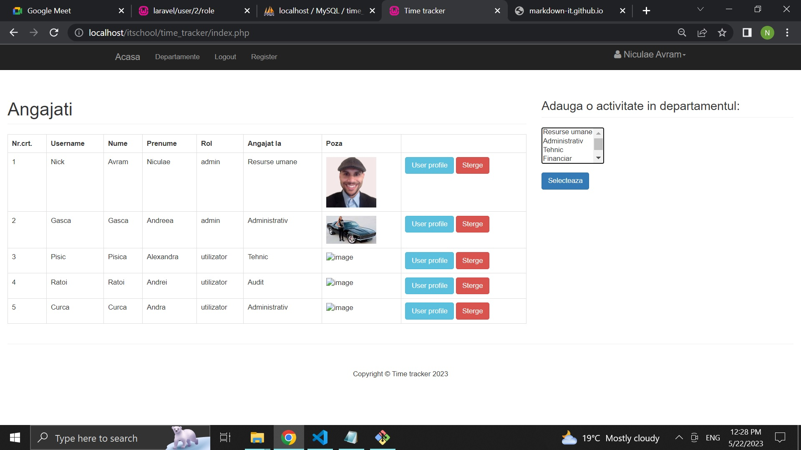

# time_tracker

**Time tracker** este o aplicatie de gestionare a programului de lucru a unei companii, in care se pot inregistra angajatii si pot loga ore pt activitati(categorii) din cadrul unor departamente predefinite.
Angajatii pot avea rol de `admin` sau `utilizator`. 

### Homepage


### Introducere ore lucrate
.jpg)

### *Database schema:*

```
CREATE TABLE "UTILIZATORI"
(
  "ID" bigint, AUTO_INCREMENT,
  "NUME" character(255),
  "PRENUME" character(255),
  "USERNAME" character(255),
  "PAROLA" character(255),
  "USERNAME" character(255),
  "ROL" character(25),
  "ID_DEP_UTILIZATOR" int, 
  "STATUS" character(25)
);

CREATE TABLE "DEPARTAMENTE"
(
  "ID_DEP" bigint,AUTO_INCREMENT,
  "NUME_DEP" character(255)
);

CREATE TABLE "CATEGORII"
(
  "ID_CAT" bigint,AUTO_INCREMENT,
  "NUME_CAT" character(255),
  "ID_DEPARTAMENT_CAT" int
);

CREATE TABLE "ACTIVITATI"
(
  "ID_ACT" bigint,AUTO_INCREMENT,
  "ID" int,
  "NUME_DEP" character(255),
  "NUME_CAT" character(255),
  "DATA_ACT" date,
  "ORE_LUCRATE" int,
  "ORA_LOG" timestamp,
);
```
